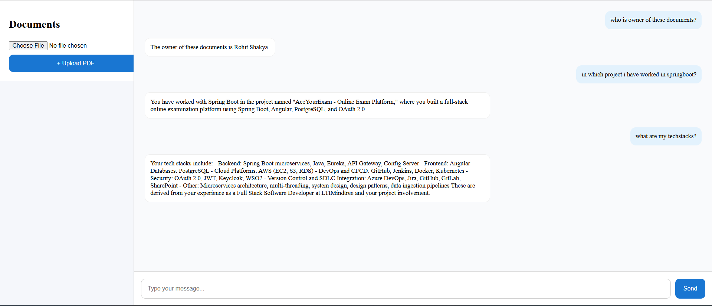

# 🚀 InsightEngine AI — AI-Powered Knowledge Retrieval System

InsightEngine AI is a full-stack AI platform that enables users to intelligently query their own data using a hybrid retrieval architecture combining **Retrieval-Augmented Generation (RAG)** and **Knowledge Graphs (KG)**.

The system supports semantic understanding, structured reasoning, and conversational querying across uploaded data sources.

---

## ✨ Features

- 📂 Upload and process user data
- 🔍 Semantic retrieval using vector embeddings (FAISS)
- 🧠 Knowledge Graph extraction using triplets
- ⚡ Hybrid Retrieval (Vector Search + KG Search)
- 💬 Conversational AI chat interface
- ⌨️ Enter-to-send messaging
- 📌 Cost-optimized KG retrieval (No KG embeddings)
- 🔄 Incremental knowledge updates
- 🌐 FastAPI backend with Angular frontend

---

# 🏗️ System Architecture

```text
                ┌────────────────────┐
                │   User Uploads     │
                │ PDFs / User Data   │
                └─────────┬──────────┘
                          │
                          ▼
                 ┌─────────────────┐
                 │ Data Processing │
                 │ Chunking Layer  │
                 └────────┬────────┘
                          │
          ┌───────────────┴────────────────┐
          │                                │
          ▼                                ▼
 ┌─────────────────┐              ┌──────────────────┐
 │ Vector Embedding │              │ Knowledge Graph │
 │ text-embedding   │              │ Triplet Extract │
 └────────┬────────┘              └────────┬─────────┘
          │                                │
          ▼                                ▼
     ┌─────────┐                     ┌──────────┐
     │  FAISS  │                     │ KG Store │
     └────┬────┘                     └────┬─────┘
          │                                │
          └──────────────┬─────────────────┘
                         ▼
                ┌────────────────┐
                │ Hybrid Retrieval│
                └────────┬───────┘
                         ▼
                ┌────────────────┐
                │ GPT-4.1-mini   │
                └────────┬───────┘
                         ▼
                 ┌──────────────┐
                 │ Final Answer │
                 └──────────────┘
```

---

# 🧩 Tech Stack

## Backend

- FastAPI
- Python
- FAISS (Vector Database)
- OpenAI API

## Frontend

- Angular
- TypeScript
- CSS

---

# 📂 Project Structure

```text
backend/
├── app.py
├── rag_faiss.py
├── kg_layer.py
├── hybrid_rag.py

frontend/
├── angular-app/
```

---

# ⚙️ Core Components

## 🔹 RAG Layer

The semantic retrieval layer:

- Chunks uploaded data
- Generates embeddings using:
  ```
  text-embedding-3-small
  ```
- Stores vectors in FAISS
- Retrieves top-k semantically relevant chunks

---

## 🔹 Knowledge Graph Layer

The Knowledge Graph layer extracts structured relationships in the form:

```text
(subject, relation, object)
```

### Example

```text
(Rohit, works_at, LTIMindtree)
```

### Retrieval Strategy

- Token matching
- Scoring-based ranking
- Symbolic relationship lookup

### Cost Optimization

Unlike many GraphRAG systems:

- ❌ No embeddings are generated for KG triplets
- ✅ Reduces embedding cost significantly
- ✅ Improves scalability

---

## 🔹 Hybrid Retrieval Pipeline

```python
rag_docs = retrieve(query, index, chunks)
kg_facts = query_kg(query)

prompt = f"""
Structured Knowledge:
{kg_facts}

Context:
{rag_docs}

Question:
{query}
"""
```

This combines:

- semantic similarity search
- structured knowledge retrieval
- contextual LLM reasoning

---

# 🌐 API Endpoints

| Endpoint      | Description               |
| ------------- | ------------------------- |
| `/upload`     | Upload user data          |
| `/ask`        | RAG-only retrieval        |
| `/hybrid-ask` | Hybrid RAG + KG retrieval |
| `/kg-query`   | Knowledge Graph querying  |

---

# 🎨 Frontend Features

The Angular frontend provides:

- 💬 Conversational AI interface
- 📄 Upload panel for user data
- ↔️ User/Bot message alignment
- ⌨️ Enter key message submission
- 🔄 Auto-scrolling chat window
- 🌐 Real-time FastAPI integration

---

# 🖼️ Application UI

> 📌 Add your latest application screenshot here



---

# 🧪 Running the Project

## Backend Setup

```bash
pip install -r requirements.txt
uvicorn app:app --reload
```

---

## Frontend Setup

```bash
cd angular-app
npm install
ng serve
```

Open:

```text
http://localhost:4200
```

---

# ⚠️ FastAPI CORS Configuration

```python
from fastapi.middleware.cors import CORSMiddleware

app.add_middleware(
    CORSMiddleware,
    allow_origins=["http://localhost:4200"],
    allow_credentials=True,
    allow_methods=["*"],
    allow_headers=["*"],
)
```

---

# 💡 Key Engineering Decisions

- ✅ Hybrid retrieval improves response quality
- ✅ Knowledge Graph adds structured reasoning
- ✅ No KG embeddings reduces operational cost
- ✅ Incremental graph updates from newly uploaded data
- ✅ Modular retrieval architecture
- ✅ Scalable for future multimodal support

---

# 🚀 Future Enhancements

- 🔥 Streaming AI responses
- 🔥 Source citations in responses
- 🔥 Multi-user support
- 🔥 Authentication & authorization
- 🔥 Replace pickle with PostgreSQL / DynamoDB
- 🔥 Support for image/audio/video querying
- 🔥 Graph visualization dashboard

---

# 🌍 Real-World Use Cases

- Enterprise knowledge assistants
- AI document copilots
- Research assistants
- Internal company search systems
- Customer support AI
- Multimodal AI retrieval systems

---

# 👨‍💻 Author

## Rohit Shakya

- Full Stack Developer
- Backend-focused Engineer
- Java • Spring Boot • Python • Angular
- Working at LTIMindtree

---

# ⭐ Support

If you like this project:

- Give it a star ⭐
- Fork the repository
- Feel free to contribute
